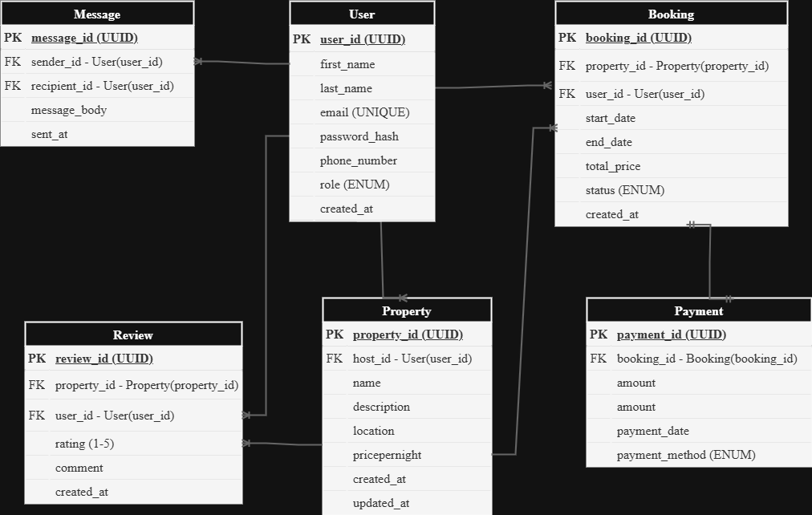

# Task 0: Define Entities and Relationships in ER Diagram

## 📘 Overview

This document outlines the Entity-Relationship Diagram (ERD) for an Airbnb-like application. It identifies key entities, their attributes, and the relationships between them to guide database schema design for a scalable and normalized system.

---

## 🧩 Entities and Attributes

### 1. **User**
- `user_id` (UUID, Primary Key, Indexed)
- `first_name` (VARCHAR, NOT NULL)
- `last_name` (VARCHAR, NOT NULL)
- `email` (VARCHAR, UNIQUE, NOT NULL)
- `password_hash` (VARCHAR, NOT NULL)
- `phone_number` (VARCHAR, NULL)
- `role` (ENUM: guest, host, admin, NOT NULL)
- `created_at` (TIMESTAMP, DEFAULT CURRENT_TIMESTAMP)

### 2. **Property**
- `property_id` (UUID, Primary Key, Indexed)
- `host_id` (Foreign Key → User.user_id)
- `name` (VARCHAR, NOT NULL)
- `description` (TEXT, NOT NULL)
- `location` (VARCHAR, NOT NULL)
- `pricepernight` (DECIMAL, NOT NULL)
- `created_at` (TIMESTAMP, DEFAULT CURRENT_TIMESTAMP)
- `updated_at` (TIMESTAMP, ON UPDATE CURRENT_TIMESTAMP)

### 3. **Booking**
- `booking_id` (UUID, Primary Key, Indexed)
- `property_id` (Foreign Key → Property.property_id)
- `user_id` (Foreign Key → User.user_id)
- `start_date` (DATE, NOT NULL)
- `end_date` (DATE, NOT NULL)
- `total_price` (DECIMAL, NOT NULL)
- `status` (ENUM: pending, confirmed, canceled, NOT NULL)
- `created_at` (TIMESTAMP, DEFAULT CURRENT_TIMESTAMP)

### 4. **Payment**
- `payment_id` (UUID, Primary Key, Indexed)
- `booking_id` (Foreign Key → Booking.booking_id)
- `amount` (DECIMAL, NOT NULL)
- `payment_date` (TIMESTAMP, DEFAULT CURRENT_TIMESTAMP)
- `payment_method` (ENUM: credit_card, paypal, stripe, NOT NULL)

### 5. **Review**
- `review_id` (UUID, Primary Key, Indexed)
- `property_id` (Foreign Key → Property.property_id)
- `user_id` (Foreign Key → User.user_id)
- `rating` (INTEGER, CHECK: 1 ≤ rating ≤ 5, NOT NULL)
- `comment` (TEXT, NOT NULL)
- `created_at` (TIMESTAMP, DEFAULT CURRENT_TIMESTAMP)

### 6. **Message**
- `message_id` (UUID, Primary Key, Indexed)
- `sender_id` (Foreign Key → User.user_id)
- `recipient_id` (Foreign Key → User.user_id)
- `message_body` (TEXT, NOT NULL)
- `sent_at` (TIMESTAMP, DEFAULT CURRENT_TIMESTAMP)

---

## 🔗 Relationships

| Relationship                    | Type         |
|---------------------------------|--------------|
| User → Property (host)          | One-to-Many  |
| User → Booking (guest)          | One-to-Many  |
| User → Review                   | One-to-Many  |
| User → Message (sender/receiver)| One-to-Many  |
| Property → Booking              | One-to-Many  |
| Booking → Payment               | One-to-One   |
| Property → Review               | One-to-Many  |
| Booking → User                  | Many-to-One  |
| Booking → Property              | Many-to-One  |

---

## 🗂 Indexing & Constraints

- **Primary Keys**: Indexed automatically.
- **Unique Index**: `User.email`
- **Foreign Keys**:
  - `Property.host_id` → `User.user_id`
  - `Booking.property_id` → `Property.property_id`
  - `Booking.user_id` → `User.user_id`
  - `Payment.booking_id` → `Booking.booking_id`
  - `Review.property_id` → `Property.property_id`
  - `Review.user_id` → `User.user_id`
  - `Message.sender_id` and `Message.recipient_id` → `User.user_id`
- **Check Constraint**: `Review.rating` must be between 1 and 5.

---

## 📊 ER Diagram

The diagram above visualizes all entities and their relationships based on the specification.

